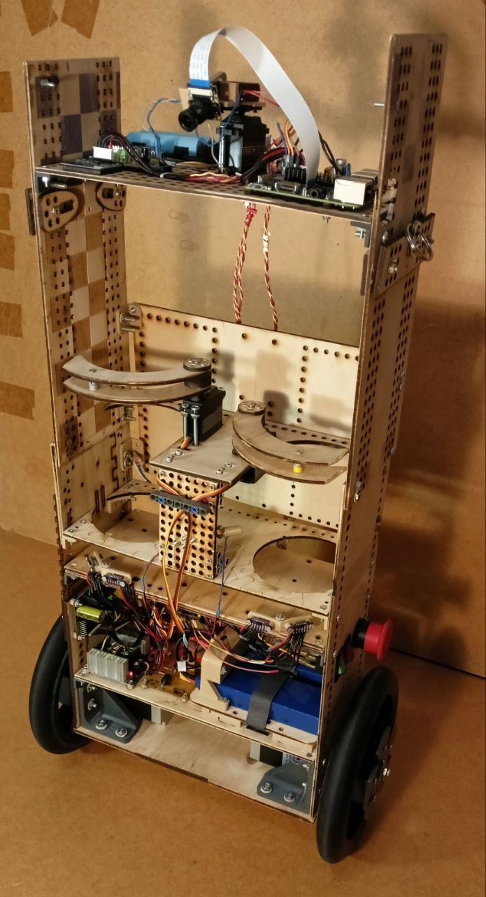

# МАПС - Мобильный Автономный Помощник Сотрудника.

Балансирующий робот-официант на esp32s3 и Raspberry Pi 3B.
Удерживает равновесие на двух колесах, следит за инфракрасными метками на ногах оператора с помощью компьютерного зрения, и следует за ним. Управление - через сенсорные кнопки на верхней панели. Также есть веб-страница на Flask для вывода изображения с камеры на экран компьютера или смартфона.

## Электроника и оборудование
- ESP32-S3 - главный контроллер
- Raspberry Pi 3B - обработка видео
- Шаговые двигатели Nema23 для движения
- IMU BNO055(9-DOF) для балансировки
- Камера(640*480)
- Дальномеры VL53L0X, чтобы не врезаться в препятствия
- Сервоприводы для захватов и подвижного кронштейна камеры

Для размещения большинства электронных компонентов разработана материнская плата. Для коммуникации питания и размещения защитных диодов(в целях изоляции наводок от шаговых двигателей) - коммутационная плата питания. Обе платы спроектированы в EasyEDA и изготовлены самостоятельно по лазерно-утюжной технологии(ЛУТ).
Трассировки плат, общая схема представлены в папке docs/schematic. Дополнительную информацию можно найти в пояснительной записке - технической документации к проекту, в папке docs.

## Код
ПО для ESP32 написано в ESP-IDF и скомпилировано через Powershell;
RPI запрограммирована на Python 3, веб-страница - на HTML.

Веб-страница для просмотра изображения с камеры: http://10.42.0.1:5000
(для доступа к веб-странице, очевидно, нужно подключиться к AP Raspberry.)

## Дополнительные сведения
Документация(пояснительная записка) к проекту, трассировки плат,
электрическая структурная схема всего робота Э1(по ГОСТ), сборочный чертеж материнской
платы представлены в этом репозитории в папке docs. Весь код - для esp32 и для raspberry pi - 
в папке src.
Видео с демонстрацией работоспособности устройства на школьной конференции:
https://vk.com/wall847242338_1
